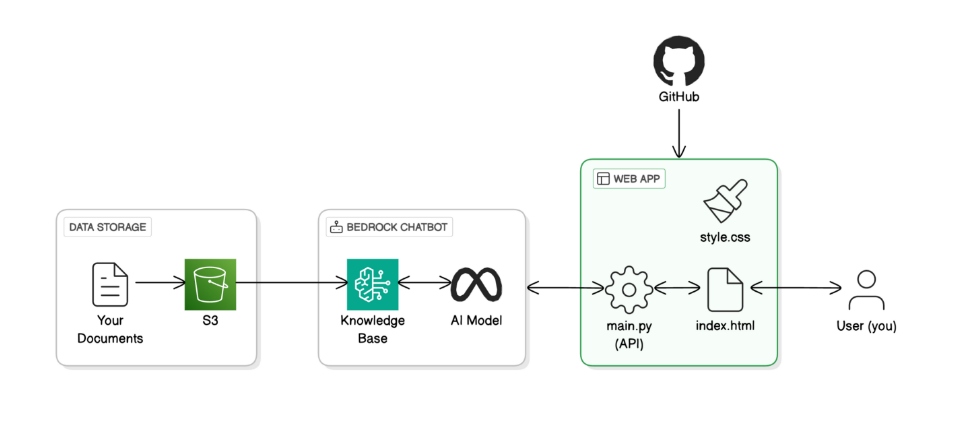

# RAG Chatbot Web App

## Project Overview
This project demonstrates building a Retrieval-Augmented Generation (RAG) chatbot with a custom web interface. The purpose of this project was to create a chatbot for my portfolio web app that can answer the questions related to my project's documentations.

## **Architecture Flow**
1️⃣ **Knowledge Base Setup** – Using **Amazon S3 & OpenSearch Serverless** to store and retrieve documents.  
2️⃣ **AI Model Integration** – Connecting **AWS Bedrock** to generate intelligent responses.  
3️⃣ **API Development** – Creating a **FastAPI-based backend** for processing chatbot queries.  
4️⃣ **Frontend Connection** – Sending queries to the API from a **custom-built web interface**.  

## 🛠 Technologies Used

### Backend:

- `Python`
- `FastAPI`
- `Boto3`

### Frontend:

- `HTML`
- `JavaScript`
- `CSS`

### Cloud Services:

- `Amazon Bedrock`
- `Amazon S3`
- `OpenSearch Serverless`

### Infrastructure:

- `AWS IAM`
- `Virtual Environment`

## Connect with me 

**Kanika Mathur**  
- [E-mail](mkanika.90@gmail.com)
- [GitHub](https://github.com/KanikaGenesis)  
- [LinkedIn](https://www.linkedin.com/in/kanika-mathur-083080121)  